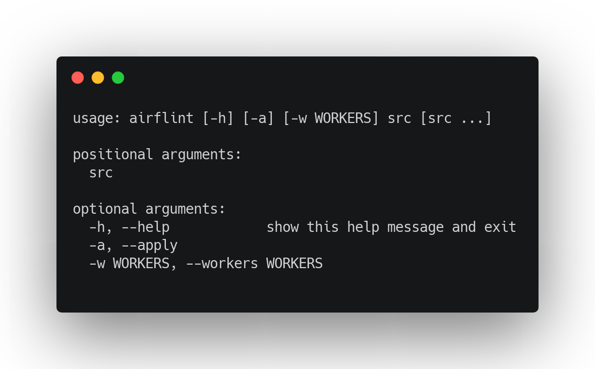

# airflint

[](https://results.pre-commit.ci/latest/github/feluelle/airflint/main)


[](https://codecov.io/gh/feluelle/airflint)
[](https://pypi.org/project/airflint/)
[](https://github.com/feluelle/airflint/blob/main/LICENSE)
[](https://pypi.org/project/airflint/)
[](https://pypi.org/project/airflint/)

> Enforce Best Practices for all your Airflow DAGs. ⭐

## 🧑‍🏫 Rules

- [x] Use function-level imports instead of top-level imports[^1][^2] (see [Top level Python Code](https://airflow.apache.org/docs/apache-airflow/stable/best-practices.html#top-level-python-code))
- [x] Use jinja macro instead of `Variable.get` (see [Airflow Variables](https://airflow.apache.org/docs/apache-airflow/stable/best-practices.html#airflow-variables))

[^1]: There is a PEP for [Lazy Imports](https://peps.python.org/pep-0690/) targeted to arrive in Python 3.12 which would supersede this rule.

[^2]: To remove top-level imports after running `UseFunctionLevelImports` rule, use a tool such as [autoflake](https://github.com/PyCQA/autoflake).

_based on official [Best Practices](https://airflow.apache.org/docs/apache-airflow/stable/best-practices.html)_

## 🚀 Get started

To install it from [PyPI](https://pypi.org/) run:

```console
pip install airflint
```

Then just call it like this:



### pre-commit

Alternatively you can add the following repo to your `pre-commit-config.yaml`:

```yaml
  - repo: https://github.com/feluelle/airflint
    rev: v0.2.0-alpha
    hooks:
      - id: airflint
        args: ["-a"]  # Use -a for replacing inplace
```

To complete the `UseFunctionlevelImports` rule, please add the `autoflake` hook after the `airflint` hook, as below:

```yaml
  - repo: https://github.com/pycqa/autoflake
    rev: v1.4
    hooks:
      - id: autoflake
        args: ["--remove-all-unused-imports", "--in-place"]
```

This will remove unused imports.
